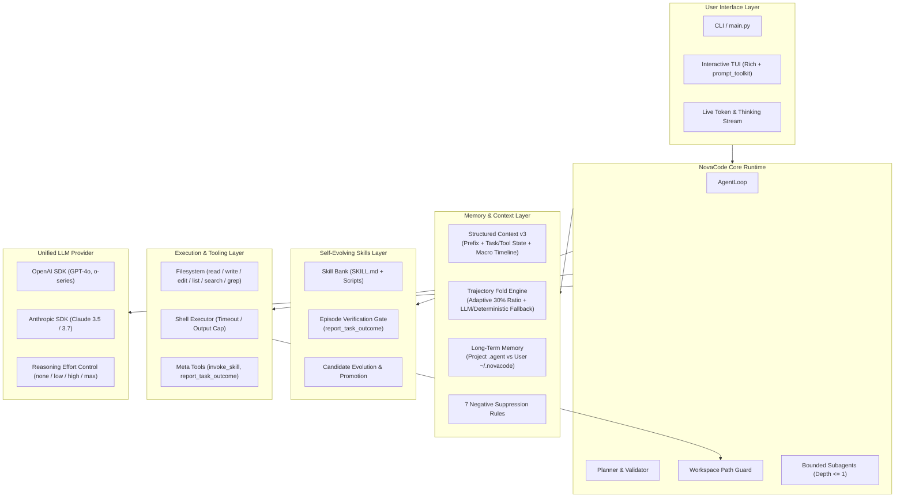

# NovaCode

<p align="center">
  <strong>A lightweight, hackable, and production-grade coding agent harness in Python 3.11+.</strong>
</p>

<p align="center">
  <a href="README.md"><strong>English</strong></a> |
  <a href="README_zh.md"><strong>简体中文</strong></a>
</p>

<p align="center">
  
  
  
  
</p>

---

## 🌟 Highlights & Philosophy

NovaCode drives Large Language Models (LLMs) to complete real-world software engineering tasks inside isolated workspaces. Built from first principles, it prioritizes **transparency, predictability, and hackability** over opaque multi-agent frameworks or heavy workflow DAGs.

- ⚡ **Minimal & Understandable Core**: Single `AgentLoop` runtime with explicit state transitions, strict tool execution boundaries, and zero opaque abstractions.
- 🧊 **KV-Cache Friendly Structured Context (v3)**: Stable prefix invariance, adaptive trajectory folding, typed state delta compaction, and crash recovery with immutable checkpoints.
- 🧠 **Durable Long-Term Memory**: Project-local and user-global memory stores with out-of-band two-stage prefetch, bilingual tokenization, and deterministic 7-rule negative suppression.
- 🛠️ **Self-Evolving Skills & Task Episodes**: Episode-gated skill evolution grounded in AutoSkill, CODESKILL, and CoEvoSkills research, loaded on-demand via fixed meta-tools without prompt bloat.
- 💻 **Modern Interactive TUI**: Real-time markdown token streaming, prompt_toolkit interactive interface, collapsible reasoning/thinking inspection (`/think`), and slash commands.
- 🧪 **Rigorous Benchmark Integrations**: Built-in harnesses for **SWE-bench Verified**, **AMA-Bench** (ICML 2026 memory benchmark with standalone runner & judge), and Context Reduction Ratio (CRR) evaluation.

---

## 🏗️ System Architecture



---

## 🚀 Quick Start

### 1. Installation

```bash
# Create and activate virtual environment
python3.11 -m venv .venv && source .venv/bin/activate

# Install NovaCode in editable mode
pip install -e .

# (Optional) Install SWE-bench evaluation extras
pip install -e ".[swebench]"
```

### 2. Configure Environment

Create or edit `.env` in your project root:

```bash
# Provider: openai | anthropic
NOVACODE_PROVIDER=openai
NOVACODE_MODEL=gpt-4o-mini
OPENAI_API_KEY=sk-...

# Or for Anthropic:
# NOVACODE_PROVIDER=anthropic
# NOVACODE_MODEL=claude-3-5-sonnet-latest
# ANTHROPIC_API_KEY=sk-ant-...

# Optional OpenAI-compatible base URL (vLLM, Ollama, DeepSeek, etc.)
# NOVACODE_BASE_URL=https://api.openai.com/v1
```

### 3. Usage Examples

```bash
# One-shot task with Planner Mode
novacode "Add health check endpoint and write unit tests" --workspace ./myproject --planner

# Start Interactive Rich TUI
novacode --interactive

# Continue an existing session
novacode "Now add rate limiting to the health check" --session <session_id>

# Run with Structured Context (v3 checkpoint-resume storage)
novacode "Refactor database models" --structured-context --workspace ./myproject

# Inspect skill bank and evolution status without making LLM calls
novacode --skill-eval --workspace ./myproject

# List all stored sessions
novacode --list-sessions

# Run offline demo (Deterministic scripted provider, zero API keys needed)
python demo.py
```

---

## 🧩 Key Subsystems

### 1. Structured Context & Trajectory Folding (v3)

Long-horizon software tasks quickly exceed context windows and degrade LLM performance. NovaCode v3 introduces a KV-Cache-friendly structured context system:

- **Physical Layout**:
  - `Stable Prefix`: Frozen system prompt for maximum KV cache hits.
  - `Task State & Tool State`: Structured key findings, decisions, file modifications, and environment constraints.
  - `Macro Timeline`: High-level step summaries tracking task trajectory across epochs.
  - `Recent Trajectory`: Most recent interaction groups kept verbatim.
  - `Raw Artifact Store`: Large tool outputs offloaded to disk (`.agent/sessions/<id>/artifacts/`).
- **Adaptive Trajectory Folding**: Folds oldest interaction groups when context exceeds threshold, compressing down to target ratio (default 30%) with LLM-assisted extraction and deterministic fallback.
- **Crash Recovery & Checkpoints**: Immutable snapshot checkpoints + replay from append-only `events.jsonl`.
- **Workspace Drift Reconciliation**: Validates git hashes and workspace state before turns, auto-classifying state as `RESUME`, `REPLAN`, or `BLOCKED`.

```bash
# Migrate a legacy flat session to structured context storage
novacode --structured-context --migrate-legacy-session <session_id>
```

---

### 2. KV-Cache Friendly Long-Term Memory

Cross-session knowledge retention without polluting prompt prefixes or degrading prompt cache:

- **Dual-Tier Isolation**:
  - **Project Memory** (`<workspace>/.agent/memories/`): Architecture conventions, tech stacks, repository facts.
  - **User Memory** (`~/.novacode/memories/`): Developer preferences, workflows, personal styling.
- **4-Category Taxonomy**:
  1. `user_preference`: User interaction habits and developer preferences.
  2. `project_fact`: Immutable architectural and environmental invariants.
  3. `decision_record`: Historical architectural choices and validated bugfix recipes.
  4. `tool_experience`: Environment quirks and specific command workarounds.
- **7 Negative Suppression Rules**: Rejects ephemeral workspace observations ("folder is empty"), unverified theories, transient errors, and duplicate facts.
- **Out-of-Band Prefetch**: Retrieval runs outside the main LLM context; relevant memories are injected dynamically into the current turn slot without altering past turn history.

---

### 3. Self-Evolving Skills & Task Episodes

Inspired by **AutoSkill**, **CODESKILL**, and **CoEvoSkills**:

- **On-Demand Execution**: Skills are discovered from `.agent/skills/` (project) and `~/.novacode/skills/` (user) and executed via the fixed `invoke_skill` schema, preventing prompt bloat.
- **Episode Verification Gate**: Sessions record task transitions in `episodes.jsonl`. Skills are only promoted after `report_task_outcome(disposition="completion_proposed", ...)` passes rigorous verification and deterministic evidence checks.
- **Candidate Lifecycle**: `Observed` -> `Pending Candidate` -> `Verified Promotion` -> `Skill Bank`.

---

### 4. Interactive TUI & Live Streaming

- Built with `rich` and `prompt_toolkit`.
- Full token streaming for both OpenAI and Anthropic providers.
- **Collapsible Reasoning/Thinking**: Collapses model chain-of-thought to a clean single line; expand/collapse on demand using `/think`.
- Interactive slash commands: `/think`, `/plan`, `/clear`, `/help`, `/exit`.

---

## 📊 Benchmarks & Evaluations

### 1. SWE-bench Verified Evaluation

Run NovaCode against SWE-bench instances with Docker network isolation:

```bash
# Run one instance (e.g. sympy__sympy-20590)
python -m evals.swe_bench run   --dataset verified   --instance sympy__sympy-20590   --output .eval-results/swe-sympy-20590

# Grade the generated patch using official harness
swebench eval verified   -p .eval-results/swe-sympy-20590/predictions.jsonl   --run-id novacode-sympy-20590 -j 1
```

### 2. AMA-Bench (ICML 2026 Long-Horizon Memory Benchmark)

NovaCode provides a native adapter (`NovaCodeMemoryMethod`), standalone runner, and self-contained LLM-as-judge:

```bash
# 1. Download AMA-Bench dataset
huggingface-cli download AMA-bench/AMA-bench --repo-type dataset --local-dir ./dataset

# 2. Run evaluation on open-ended tasks
python -m ama_bench.run   --dataset dataset/test/open_end_qa_set.jsonl   --episode-ids 0,1,2   --output results/novacode_openend.jsonl   --audit-dir results/audit

# 3. Evaluate answers with self-contained LLM-as-judge
python -m ama_bench.judge   --answers-file results/novacode_openend.jsonl   --test-file dataset/test/open_end_qa_set.jsonl   --output-file results/evaluation.json
```

See [README_AMA_BENCH.md](README_AMA_BENCH.md) for full benchmarks and audit documentation.

### 3. Structured Context Reduction Benchmarks

Evaluate token savings, Context Reduction Ratio (CRR), and p50/p95 prompt costs:

```bash
# Deterministic offline replay (no API calls)
python -m evals.structured_context offline --output .eval-results/offline

# Scripted end-to-end smoke evaluation
python -m evals.structured_context run --scripted --scenario short-01   --variant raw_full --variant structured --output .eval-results/scripted
```

---

## ⚙️ Configuration Reference

Configuration resolution follows: **CLI Flags > Shell Environment Variables > `.env` File > Defaults**.

| Variable | CLI Flag | Default | Description |
|---|---|---|---|
| `NOVACODE_PROVIDER` | `--provider` | `openai` | LLM provider: `openai` or `anthropic` |
| `NOVACODE_MODEL` | `--model` | `gpt-4o-mini` | Model identifier |
| `OPENAI_API_KEY` / `ANTHROPIC_API_KEY` | `--api-key` | `None` | Provider authentication key |
| `NOVACODE_BASE_URL` | `--base-url` | `None` | Custom OpenAI-compatible endpoint |
| `NOVACODE_WORKSPACE` | `--workspace` | `.` | Target workspace directory |
| `NOVACODE_PLANNER` | `--planner` | `false` | Enable Planner Mode |
| `NOVACODE_MAX_TOKENS` | - | `4096` | Max output tokens per model generation |
| `NOVACODE_REASONING_EFFORT` | - | `none` | Thinking effort: `none`, `low`, `high`, `max` |
| `NOVACODE_SHOW_THINKING` | - | `false` | Display model thinking in TUI (`1`/`true`) |
| `NOVACODE_STRUCTURED_CONTEXT` | `--structured-context` | `false` | Enable Structured Context v3 storage |
| `NOVACODE_STORAGE_LOCATION` | `--storage-location` | `project` | Storage root: `project` (`.agent`) or `user` (`~/.novacode`) |
| `NOVACODE_GLOBAL_MEMORY_LOCATION`| `--global-memory-location` | `user` | Global memory root: `user` or `agent` |

---

## 📁 Repository Structure

```text
novacode/
├── main.py                        # CLI entry point
├── config.py                      # Global configuration and dataclasses
├── demo.py                        # Offline deterministic runnable demo
├── coding_agent/                  # Core Agent implementation
│   ├── agent.py                   # Main AgentLoop execution engine
│   ├── llm/                       # Unified LLM provider protocols & adapters
│   ├── tools/                     # 8 core tools, registry, executor, path guard
│   ├── context/                   # Legacy session management
│   ├── structured_context/        # v3 Structured context, folding, checkpoints
│   ├── long_term_memory/          # KV-cache-friendly memory & suppression
│   ├── skills/                    # Self-evolving skills bank, verifier & hooks
│   ├── runtime/                   # Planner, validator, constraints, trace logger
│   └── tui/                       # Rich & prompt_toolkit interactive interface
├── ama_bench/                     # AMA-Bench ICML 2026 adapter, runner & judge
├── evals/                         # Benchmark testbeds
│   ├── swe_bench/                 # SWE-bench verified Docker runner
│   └── structured_context/        # Context reduction ratio evaluation suite
├── tests/                         # Full automated pytest test suite (185+ tests)
├── README.md                      # English documentation
├── README_zh.md                   # Chinese documentation
└── README_AMA_BENCH.md            # AMA-Bench in-depth documentation
```

---

## 🧪 Testing

NovaCode maintains a comprehensive test suite covering all subsystems:

```bash
# Run all unit and integration tests
pytest

# Run tests with coverage or specific modules
pytest tests/test_structured_context.py
pytest tests/test_long_term_memory.py
pytest tests/test_skills.py
pytest tests/test_ama_bench.py
pytest tests/test_swe_bench.py
```

---

## 📄 License

NovaCode is licensed under the [MIT License](LICENSE).
