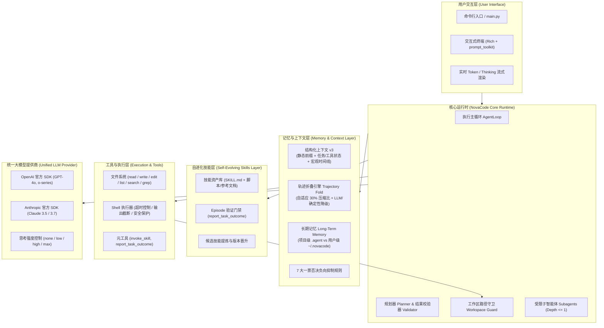

# NovaCode

<p align="center">
  <strong>轻量、透明、生产级 Python 3.11+ 编程智能体框架（Coding Agent Harness）</strong>
</p>

<p align="center">
  <a href="README.md"><strong>English</strong></a> |
  <a href="README_zh.md"><strong>简体中文</strong></a>
</p>

<p align="center">
  
  
  
  
</p>

---

## 🌟 核心亮点与设计理念

NovaCode 是一个专为软件工程任务打造的 Coding Agent 框架。从第一性原理出发，NovaCode 追求**透明、可预测、高可扩展与极简易懂**，摒弃了黑盒复杂的工作流 DAG、过度设计的 Reflexion 机制与臃肿的多 Agent 堆叠。

- ⚡ **极简清晰的执行核心**：轻量统一的 `AgentLoop` 运行时，显式状态流转，严格的工具权限边界与零多余抽象。
- 🧊 **KV-Cache 友好的结构化上下文（v3）**：静态前缀绝对冻结、自适应轨迹折叠（Adaptive Trajectory Folding）、类型化增量状态压缩与基于不可变 Checkpoint 的崩溃恢复。
- 🧠 **跨会话持久化长期记忆**：项目级（`.agent/memories/`）与用户级（`~/.novacode/memories/`）双层隔离，带外两阶段预取，中英双语分词索引与 7 大确定性负向抑制规则。
- 🛠️ **自进化技能与任务 Episode 体系**：融合 AutoSkill、CODESKILL 与 CoEvoSkills 理论，通过固定元工具按需动态调用，配合确定性 Episode 验证门禁实现技能自动提炼与进化。
- 💻 **现代化交互式 TUI**：基于 Rich 与 prompt_toolkit 构建，支持端到端 Token 流式渲染、模型思维链折叠与展开（`/think`）、实时 Slash 指令系统。
- 🧪 **标准化基准测评生态**：内置 **SWE-bench Verified**（Docker 容器隔离单实例评测）、**AMA-Bench**（ICML 2026 智能体长程记忆评测，包含独立 Runner 与 LLM 裁判）与上下文压缩比（CRR）评测套件。

---

## 🏗️ 系统架构



---

## 🚀 快速上手

### 1. 环境安装

```bash
# 创建并激活 Python 3.11+ 虚拟环境
python3.11 -m venv .venv && source .venv/bin/activate

# 以可编辑模式安装 NovaCode
pip install -e .

# （可选）安装 SWE-bench 评测扩展依赖
pip install -e ".[swebench]"
```

### 2. 配置环境变量

在项目根目录下创建或编辑 `.env` 文件：

```bash
# 模型提供商: openai | anthropic
NOVACODE_PROVIDER=openai
NOVACODE_MODEL=gpt-4o-mini
OPENAI_API_KEY=sk-...

# 若使用 Anthropic:
# NOVACODE_PROVIDER=anthropic
# NOVACODE_MODEL=claude-3-5-sonnet-latest
# ANTHROPIC_API_KEY=sk-ant-...

# 可选：自定义 OpenAI 兼容接口地址 (如 vLLM, Ollama, DeepSeek 等)
# NOVACODE_BASE_URL=https://api.openai.com/v1
```

### 3. 使用示例

```bash
# 单次任务执行（开启规划模式）
novacode "为当前项目添加健康检查端点并编写单元测试" --workspace ./myproject --planner

# 启动交互式 Rich TUI 终端
novacode --interactive

# 恢复并继续历史会话
novacode "继续为健康检查接口添加限流功能" --session <session_id>

# 启用结构化上下文模式（v3 Checkpoint-Resume 机制）
novacode "重构数据库模型层" --structured-context --workspace ./myproject

# 查看当前技能库与待进化候选窗口（无需调用大模型 API）
novacode --skill-eval --workspace ./myproject

# 列出所有已保存的历史会话
novacode --list-sessions

# 运行离线演示（使用确定性本地脚本 Provider，无需任何 API Key）
python demo.py
```

---

## 🧩 核心子系统详解

### 1. 结构化上下文与轨迹折叠 (v3)

在长程代码任务中，上下文过长会导致模型注意力发散并急剧推高 API 成本。NovaCode v3 提出了与大模型 KV Cache 深度协同的结构化上下文管理机制：

- **物理布局**：
  - `Stable Prefix`：系统提示词完全冻结，保障系统级 KV Cache 前缀高频命中。
  - `Task State & Tool State`：增量维护关键结论、架构决策、已修改文件列表及环境约束。
  - `Macro Timeline`：跨 Epoch 的宏观任务阶段摘要，完整保留长程任务时间线。
  - `Recent Trajectory`：最近交互组（Interaction Groups）保持逐字原始对话。
  - `Raw Artifact Store`：工具的大段原始输出自动下沉至磁盘（`.agent/sessions/<id>/artifacts/`）。
- **自适应轨迹折叠**：当上下文达到触发阈值（如 70%）时，自动将最旧交互组折叠提炼至 Task/Tool State，压缩至目标比例（默认 30%），支持大模型提炼与确定性规则降级。
- **崩溃恢复与 Checkpoint**：不可变快照 Checkpoint + 基于 `events.jsonl` 的未持久化事件快速回放。
- **工作区漂移自愈**：在每轮开始前校验 Git Hash 与工作区快照，自动判定为 `RESUME`、`REPLAN` 或 `BLOCKED` 状态并协同恢复。

```bash
# 将旧版平铺式会话迁移至结构化存储
novacode --structured-context --migrate-legacy-session <session_id>
```

---

### 2. KV-Cache 友好型长期记忆系统

跨会话沉淀经验与知识，同时杜绝提示词前缀漂移对 KV Cache 的破坏：

- **双层资产隔离**：
  - **项目专属级**（`<workspace>/.agent/memories/`）：架构规范、技术栈选型、代码库事实。
  - **用户全局级**（`~/.novacode/memories/`）：个人工作流习惯、代码风格偏好、通用排错技巧。
- **4 种结构化分类**：
  1. `user_preference`：用户交互偏好与开发者习惯。
  2. `project_fact`：不可变的架构与环境事实。
  3. `decision_record`：历史技术选型与经验证的排错配方。
  4. `tool_experience`：特定环境命令或工具调用的避坑经验。
- **7 大一票否决负向抑制规则**：严禁保存未验证的临时假设、未经修改即可通过 grep 检索的代码事实、瞬时工作区状态（如“当前目录为空”）、临时报错等。
- **带外异步检索**：记忆检索独立于主对话上下文之外执行，召回结果仅注入当前轮次动态槽位，历史消息永不修改。

---

### 3. 自进化技能与任务 Episode 体系

汲取 **AutoSkill**（自进化闭环）、**CODESKILL**（双粒度提炼）与 **CoEvoSkills**（多文件包与验证）论文精髓：

- **固定元工具调用**：技能资产存储于 `.agent/skills/` 与 `~/.novacode/skills/`，通过固定的 `invoke_skill` 模式按需挂载执行，不增加系统提示词负担。
- **Episode 验证门禁**：通过 `episodes.jsonl` 追踪任务流转。仅当 Agent 调用 `report_task_outcome(disposition="completion_proposed", ...)` 且通过确定性测试与证据验证时，任务才判定为成功并触发技能提炼。
- **生命周期流转**：`观察阶段 (Observed)` $	o$ `候选池 (Pending Candidate)` $	o$ `门禁验证与晋升 (Verified Promotion)` $	o$ `正式技能库 (Skill Bank)`。

---

### 4. 交互式 TUI 与流式渲染

- 基于 `rich` 与 `prompt_toolkit` 构建，界面现代化且操作流畅。
- 支持 OpenAI 与 Anthropic 的全链路 Token 实时流式输出。
- **思维链可折叠渲染**：大模型思考过程在终端默认折叠为一行摘要，输入 `/think` 可随时展开/折叠完整思考链。
- 快捷指令支持：`/think`、`/plan`、`/clear`、`/help`、`/exit`。

---

## 📊 标准化基准评测

### 1. SWE-bench Verified 官方评测

支持在 Docker 容器网络隔离环境下评测真实 GitHub Issue 修复能力：

```bash
# 运行单个 SWE-bench 实例（如 sympy__sympy-20590）
python -m evals.swe_bench run   --dataset verified   --instance sympy__sympy-20590   --output .eval-results/swe-sympy-20590

# 使用官方评测套件对生成的 Patch 进行打分
swebench eval verified   -p .eval-results/swe-sympy-20590/predictions.jsonl   --run-id novacode-sympy-20590 -j 1
```

### 2. AMA-Bench（ICML 2026 长程智能体记忆评测）

NovaCode 实现了官方 `NovaCodeMemoryMethod` 适配器，并提供无需克隆 AMA-Bench 仓库的独立运行器与 LLM 裁判：

```bash
# 1. 下载 AMA-Bench 数据集
huggingface-cli download AMA-bench/AMA-bench --repo-type dataset --local-dir ./dataset

# 2. 针对开放式问答子集运行评测
python -m ama_bench.run   --dataset dataset/test/open_end_qa_set.jsonl   --episode-ids 0,1,2   --output results/novacode_openend.jsonl   --audit-dir results/audit

# 3. 使用自包含的 LLM 裁判进行自动评分
python -m ama_bench.judge   --answers-file results/novacode_openend.jsonl   --test-file dataset/test/open_end_qa_set.jsonl   --output-file results/evaluation.json
```

详细参数与审计回放说明请参考 [README_AMA_BENCH.md](README_AMA_BENCH.md)。

### 3. 结构化上下文压缩率评测 (CRR)

精确量化输入 Token 节省比例（Context Reduction Ratio）与 p50/p95 耗时开销：

```bash
# 确定性离线回放（零 API 费用）
python -m evals.structured_context offline --output .eval-results/offline

# 端到端快速验证冒烟测试
python -m evals.structured_context run --scripted --scenario short-01   --variant raw_full --variant structured --output .eval-results/scripted
```

---

## ⚙️ 配置参数参考

参数优先级：**CLI 命令行参数 > 系统环境变量 > `.env` 文件 > 默认值**。

| 环境变量 | CLI 参数 | 默认值 | 说明 |
|---|---|---|---|
| `NOVACODE_PROVIDER` | `--provider` | `openai` | 模型提供商：`openai` 或 `anthropic` |
| `NOVACODE_MODEL` | `--model` | `gpt-4o-mini` | 模型名称 |
| `OPENAI_API_KEY` / `ANTHROPIC_API_KEY` | `--api-key` | `None` | API 认证密钥 |
| `NOVACODE_BASE_URL` | `--base-url` | `None` | 自定义 OpenAI 兼容 Base URL |
| `NOVACODE_WORKSPACE` | `--workspace` | `.` | 智能体工作区根目录 |
| `NOVACODE_PLANNER` | `--planner` | `false` | 启用规划器模式（Planner Mode） |
| `NOVACODE_MAX_TOKENS` | - | `4096` | 单次生成最大输出 Token 限制 |
| `NOVACODE_REASONING_EFFORT` | - | `none` | 思考强度：`none`, `low`, `high`, `max` |
| `NOVACODE_SHOW_THINKING` | - | `false` | TUI 界面是否默认展示思考摘要 (`1`/`true`) |
| `NOVACODE_STRUCTURED_CONTEXT` | `--structured-context` | `false` | 启用 v3 结构化上下文与持久化快照 |
| `NOVACODE_STORAGE_LOCATION` | `--storage-location` | `project` | 存储位置：`project` (`.agent`) 或 `user` (`~/.novacode`) |
| `NOVACODE_GLOBAL_MEMORY_LOCATION`| `--global-memory-location` | `user` | 全局记忆位置：`user` 或 `agent` |

---

## 📁 代码目录结构

```text
novacode/
├── main.py                        # 命令行总入口
├── config.py                      # 全局配置解析与数据结构
├── demo.py                        # 离线确定性可执行演示脚本
├── coding_agent/                  # 智能体核心实现
│   ├── agent.py                   # 核心 AgentLoop 主循环引擎
│   ├── llm/                       # 统一模型协议及 OpenAI / Anthropic 适配器
│   ├── tools/                     # 8 大核心文件与终端工具、路径安全守卫
│   ├── context/                   # 经典平铺式会话管理
│   ├── structured_context/        # v3 结构化上下文、轨迹折叠与 Checkpoint
│   ├── long_term_memory/          # KV-Cache 友好型长期记忆与负向抑制网
│   ├── skills/                    # 自进化技能库、验证门禁与 Hook 拦截器
│   ├── runtime/                   # 规划器、校验器、资源约束与 Trace 日志
│   └── tui/                       # Rich + prompt_toolkit 终端交互界面
├── ama_bench/                     # AMA-Bench ICML 2026 适配器、Runner 与裁判
├── evals/                         # 标准化评测基准套件
│   ├── swe_bench/                 # SWE-bench verified 容器化评测
│   └── structured_context/        # 上下文压缩比 (CRR) 自动化评测
├── tests/                         # 自动化测试用例集（185+ 单元与集成测试）
├── README.md                      # 英文说明文档
├── README_zh.md                   # 中文说明文档
└── README_AMA_BENCH.md            # AMA-Bench 专项深度指南
```

---

## 🧪 单元测试

NovaCode 拥有完备的自动化测试体系：

```bash
# 运行完整测试套件
pytest

# 运行指定模块测试
pytest tests/test_structured_context.py
pytest tests/test_long_term_memory.py
pytest tests/test_skills.py
pytest tests/test_ama_bench.py
pytest tests/test_swe_bench.py
```

---

## 📄 开源许可证

本项目基于 [MIT License](LICENSE) 协议开源。
